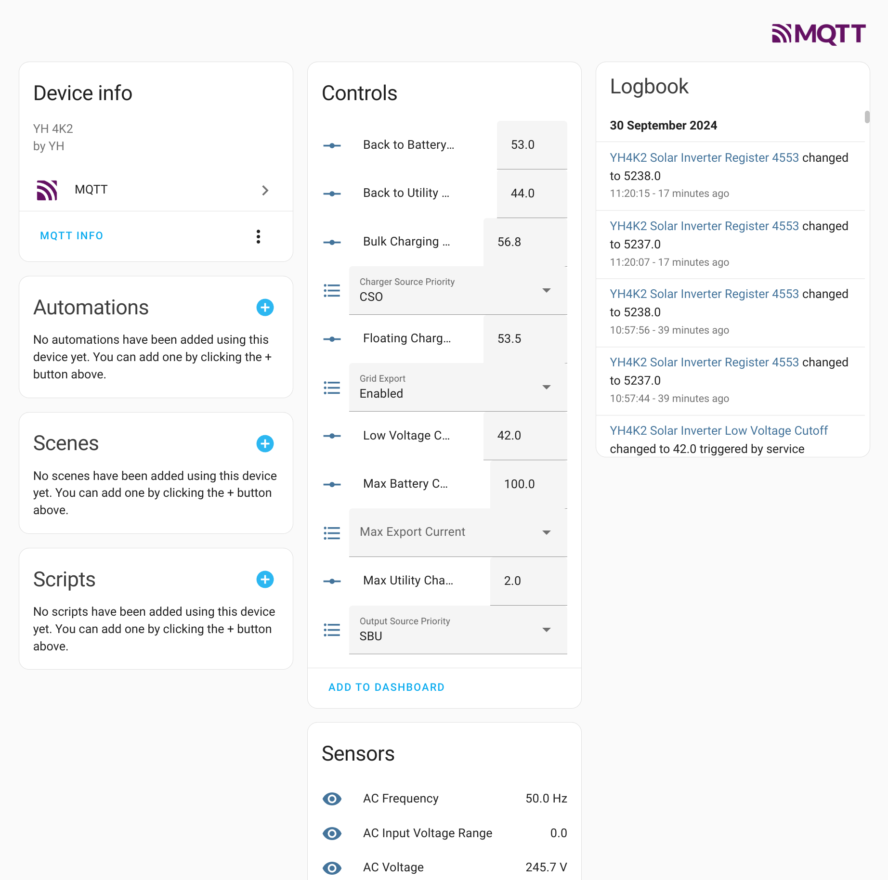
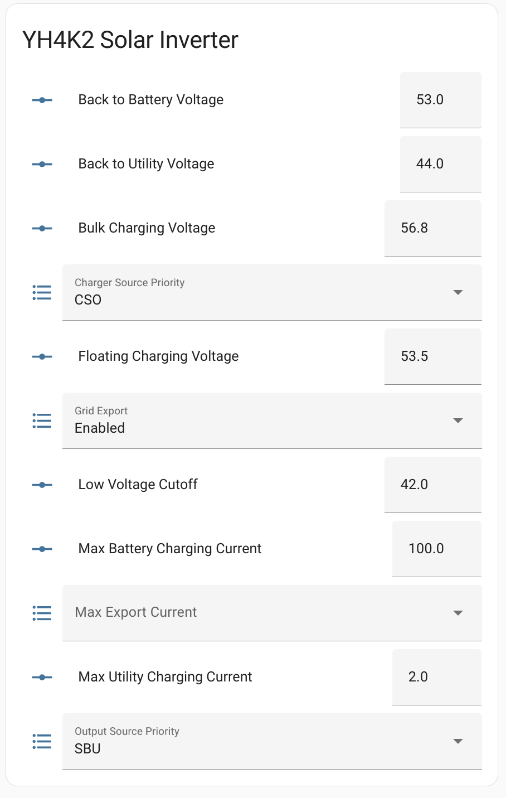
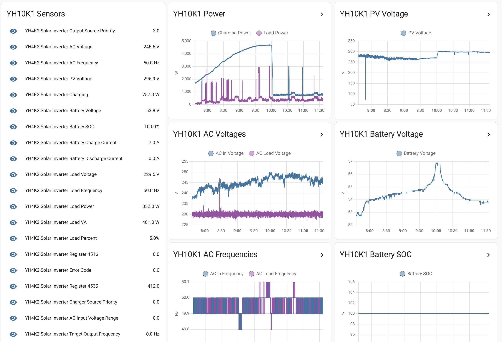

A simple script that fetches data from a Y&H invereter every second or so (via RS232 and modbus RTU) and pushes to a MQTT queue.

It makes recording stats and control of the inverter with Home Assistant possible. Autodiscovery makes setup relatively simple.

Some things are defined in the config.yaml, others in the code.

This is an early testing version.

Register data was used from here: https://github.com/odya/esphome-powmr-hybrid-inverter/blob/main/docs/registers-map.md

As well as extras defined in the docs folder.

Few screenshots below:

Device as autodiscovered in MQTT section of Homeassistant:

Controls added to a dashboard with single click from autodiscovery page:

Adding additional controls is also possible.

An example dashboard showing history (dashboard included in docs/dashboards folder):

